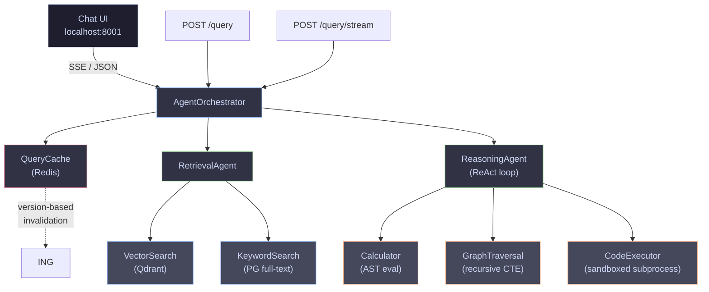
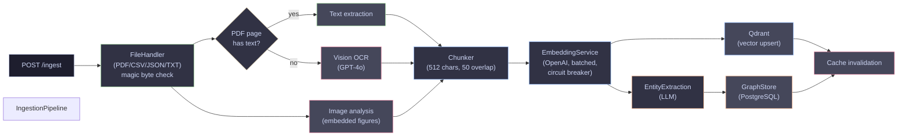
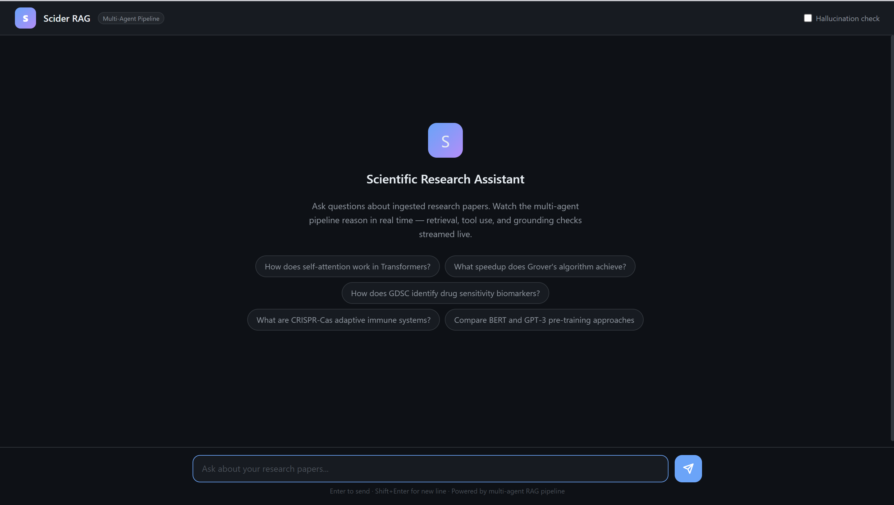
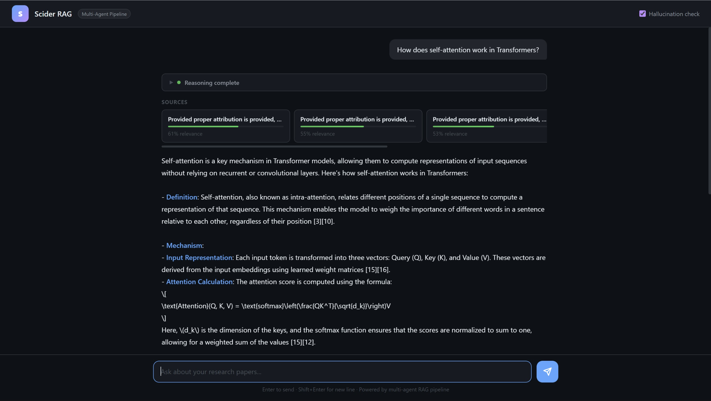

# Scider RAG

A production-grade retrieval-augmented generation pipeline for scientific documents. Ingest PDFs (including scanned/image-only), CSVs, JSONs, and plain text — then query across them with a ReAct-style multi-agent system that retrieves, reasons, uses tools, and streams its thinking in real time.

---

## What it does

- **Ingestion** — upload any scientific document. PDFs with no selectable text are handled via vision OCR; embedded figures and charts are analyzed and described before chunking. CSV and JSON files are converted to natural-language descriptions for semantic search.
- **Retrieval** — the retrieval agent plans a search strategy (vector, keyword, or hybrid) based on the query, pulls the most relevant chunks from Qdrant, and ranks them by cosine similarity.
- **Reasoning** — a ReAct loop drives multi-step reasoning with three tools: a safe AST-based calculator, a sandboxed Python executor, and a graph traversal tool for multi-hop entity queries.
- **Streaming** — every pipeline step (cache check, retrieval, tool calls, reasoning iterations) is emitted as a Server-Sent Event so the UI can render the reasoning trace progressively.
- **Hallucination detection** — opt-in claim-level grounding check using an LLM-as-judge pass over retrieved sources.

---

## Quick Start

```bash
git clone <repo>
cd scider-rag
cp .env.example .env          # set OPENAI_API_KEY=sk-...
docker compose up --build -d
```

Once healthy (~15 s):

```bash
pip3 install requests httpx
python3 -m scripts.seed_data       # ingest sample documents
python3 -m scripts.test_pipeline   # run end-to-end tests
```

| URL | What |
|---|---|
| `http://localhost:8001` | Chat UI with live reasoning trace |
| `http://localhost:8001/docs` | OpenAPI / Swagger UI |
| `http://localhost:8001/redoc` | ReDoc API docs |

### Try the streaming chat

Open `http://localhost:8001`, pick a sample question, and watch the pipeline reason in real time. Or from the terminal:

```bash
curl -N -X POST http://localhost:8001/api/v1/query/stream \
  -H "Content-Type: application/json" \
  -d '{"question": "How does self-attention work in Transformers?"}'
```

### End-to-End Walkthrough

```bash
# 1. Check all services are healthy
curl -s http://localhost:8001/api/v1/health | python3 -m json.tool
# {"status": "healthy", "services": {"postgres": "ok", "redis": "ok", "qdrant": "ok"}}

# 2. Ingest a document
curl -s -X POST http://localhost:8001/api/v1/ingest \
  -F "file=@tests/fixtures/sample_paper.txt;type=text/plain" | python3 -m json.tool
# {"document_id": "...", "chunks_created": N, "entities_extracted": N, ...}

# 3. List ingested documents
curl -s http://localhost:8001/api/v1/documents | python3 -m json.tool

# 4. Query (JSON response)
curl -s -X POST http://localhost:8001/api/v1/query \
  -H "Content-Type: application/json" \
  -d '{"question": "How does CRISPR-Cas9 work?", "max_sources": 3}' | python3 -m json.tool
# {"answer": "...", "sources": [...], "latency": {...}, "confidence": 0.xx}

# 5. Query with streaming (SSE)
curl -N -X POST http://localhost:8001/api/v1/query/stream \
  -H "Content-Type: application/json" \
  -d '{"question": "How does CRISPR-Cas9 work?", "max_sources": 3}'

# 6. Query with hallucination detection
curl -s -X POST http://localhost:8001/api/v1/query \
  -H "Content-Type: application/json" \
  -d '{"question": "How does CRISPR-Cas9 work?", "check_grounding": true}' | python3 -m json.tool
```

---

## Requirements

- **Docker + Docker Compose v2**
- **OpenAI API key** (models used: `text-embedding-3-small`, `gpt-4o-mini`)
- **Python 3.10+** on the host (only for running the seed and test scripts)

All services (PostgreSQL, Redis, Qdrant) run in containers.

### Platform setup

| Platform | Notes |
|---|---|
| **macOS** | Docker Desktop for Mac. Both Intel and Apple Silicon supported. |
| **Linux** | Docker Engine + Compose plugin, or Docker Desktop for Linux. |
| **Windows** | Docker Desktop with WSL 2 backend. Run all commands from a WSL terminal (Ubuntu), not CMD or PowerShell. |

**Windows users:**
1. `wsl --install` in PowerShell (as Administrator), then restart
2. Open the Ubuntu app, install Docker Desktop with WSL 2 integration enabled
3. Clone inside your WSL home directory (`~/projects/scider-rag`), not `/mnt/c/`

---

## Environment Variables

Copy `.env.example` to `.env`. Only `OPENAI_API_KEY` is required — everything else has working defaults for local development.

| Variable | Default | Description |
|---|---|---|
| `OPENAI_API_KEY` | *(required)* | OpenAI API key |
| `LLM_MODEL` | `gpt-4o-mini` | Chat completion model |
| `EMBEDDING_MODEL` | `text-embedding-3-small` | Embedding model |
| `EMBEDDING_DIMENSIONS` | `1536` | Embedding vector dimensions |
| `LLM_TEMPERATURE` | `0.1` | Sampling temperature |
| `LLM_MAX_TOKENS` | `2048` | Max tokens per LLM response |
| `LLM_TIMEOUT_SECONDS` | `30` | Per-call LLM timeout |
| `DATABASE_URL` | `postgresql+asyncpg://...` | PostgreSQL connection |
| `REDIS_URL` | `redis://redis:6379/0` | Redis connection |
| `QDRANT_HOST` / `QDRANT_PORT` | `qdrant` / `6333` | Qdrant connection |
| `CHUNK_SIZE` | `512` | Chunk size (chars) |
| `CHUNK_OVERLAP` | `50` | Chunk overlap (chars) |
| `RATE_LIMIT_PER_MINUTE` | `60` | Max requests per IP per minute |
| `AGENT_MAX_ITERATIONS` | `5` | ReAct loop iteration cap |
| `RETRIEVAL_TOP_K` | `10` | Chunks retrieved per query |
| `SANDBOX_TIMEOUT_SECONDS` | `10` | Code execution timeout |
| `SANDBOX_MAX_MEMORY_MB` | `256` | Code execution memory cap |
| `MAX_FILE_SIZE_MB` | `50` | Upload size limit |
| `ENABLE_OCR` | `true` | Vision OCR for scanned PDFs |
| `ENABLE_IMAGE_ANALYSIS` | `true` | Analyze embedded figures/charts |
| `OCR_MODEL` | `gpt-4o-mini` | Vision model for OCR |
| `MAX_OCR_PAGES` | `50` | Max pages to OCR per document |

---

## Architecture

### Query pipeline



### Ingestion pipeline



Each query gets a fresh `AgentContext`. No mutable state is shared between requests. A semaphore caps concurrent LLM calls at 10, and a total pipeline timeout (`3 × LLM_TIMEOUT_SECONDS`) prevents runaway requests.

---

## API Reference

| Method | Path | Description |
|---|---|---|
| `GET` | `/` | Chat UI |
| `GET` | `/api/v1/health` | Service health (Postgres, Redis, Qdrant) |
| `POST` | `/api/v1/ingest` | Upload a file (PDF, CSV, JSON, TXT) |
| `GET` | `/api/v1/documents` | List ingested documents |
| `POST` | `/api/v1/query` | Ask a question, get a JSON response |
| `POST` | `/api/v1/query/stream` | Same, but streamed as Server-Sent Events |
| `POST` | `/api/v1/eval` | Batch evaluation with LLM-as-judge scoring |

### Query request

```json
{
  "question": "How does scaled dot-product attention work in the Transformer?",
  "filters": null,
  "max_sources": 5,
  "check_grounding": false
}
```

`filters` accepts an optional dict for source-type filtering (e.g. `{"source_type": "pdf"}`).

### Query response

```json
{
  "answer": "...",
  "sources": [{"document_title": "...", "chunk_content": "...", "relevance_score": 0.87}],
  "latency": {"retrieval_ms": 1240, "reasoning_ms": 4100, "total_ms": 5360},
  "confidence": 0.72,
  "request_id": "a1b2c3d4",
  "grounding": null
}
```

`check_grounding: true` adds a `grounding` object with per-claim support status (~1–2 s extra for one additional LLM call).

### Streaming events (SSE)

| Event | Payload | When |
|---|---|---|
| `status` | `{step, message}` | Each pipeline step |
| `sources` | `[{document_title, relevance_score, …}]` | After retrieval |
| `answer` | `{text}` | After reasoning completes |
| `done` | Full result (same shape as `/query`) | Pipeline finished |
| `error` | `{message, request_id}` | On failure |

---

## Design Decisions

### No LangChain / LlamaIndex

Every abstraction is written from scratch — the ReAct loop is ~40 lines in `src/agents/reasoning.py`, retrieval strategy planning is a structured JSON prompt in `src/agents/retrieval.py`, and OpenAI function-calling drives tool dispatch directly. This keeps behaviour fully transparent and avoids the dependency bloat and version churn of framework-heavy RAG stacks.

### PostgreSQL for the entity graph

Neo4j would add a fifth operational dependency. Multi-hop traversal with cycle prevention is expressible as a single recursive CTE in PostgreSQL, keeping the stack to four services while the graph stays transactionally consistent with document and chunk data.

```sql
WITH RECURSIVE graph_walk AS (
    -- base case: direct neighbours
    -- recursive step: follow edges, guard cycles with path array
)
SELECT DISTINCT entity_id, depth, ...
```

### Version-based cache invalidation

Cache keys include a version number stored in Redis. On every ingestion, the version is incremented (`INCR cache:version`). Old entries become unreachable immediately and expire naturally via TTL — O(1) on write, no key scans.

### Cache stampede prevention

When a popular query misses the cache, concurrent requests would all trigger the LLM pipeline simultaneously. A Redis distributed lock (`SETNX`) ensures only one request computes the result; others wait, re-check the cache, and return the freshly-written value.

### Streaming as an additive layer

`run_stream()` and `execute_stream()` are parallel async generators added to `AgentOrchestrator` and `ReasoningAgent`. The original `run()` and `execute()` are completely untouched. An internal `_result` event type passes structured data between generators without forwarding it to clients.

### Hallucination detection is opt-in

Running a grounding check on every query doubles LLM cost per request. It is gated behind `check_grounding: true`. Grounding is never cached — even on cache hits, a fresh grounding check runs when requested.

### Confidence score is retrieval-based

The `confidence` field is the mean cosine similarity of the top-5 retrieved chunks — a factual measurement from the retrieval step, not the LLM's self-reported confidence. When `check_grounding: true`, callers also get `grounding.confidence` (fraction of claims judged "supported").

### Sandboxed code execution

The reasoning agent can run Python to answer quantitative questions. The sandbox enforces: subprocess isolation with `resource.setrlimit` (CPU: 10 s, memory: 256 MB), static analysis blocking dangerous patterns (`exec`, `eval`, `__import__`, `open`, `subprocess`, `os.system`), an import allowlist (`math`, `statistics`, `json`, `re`, `itertools`, `collections`, `datetime`, `decimal`, `fractions`, `functools`, `string`, `textwrap`), and a clean environment with no inherited secrets.

### Circuit breaker on OpenAI API

After 5 consecutive failures the circuit opens and calls are rejected immediately for 30 seconds, preventing cascading failures during outages. A probe request after the timeout transitions to HALF_OPEN; success closes the circuit.

---

## Security

| Layer | Mechanism |
|---|---|
| Input sanitization | HTML/XSS stripping, SQL injection detection, filename sanitization, path traversal prevention |
| File upload validation | Extension allowlist + magic byte signature verification |
| Rate limiting | Redis sliding window per IP (60 req/min) |
| Request isolation | UUID `X-Request-ID`, per-request `AgentContext`, no shared mutable state |
| Code sandbox | Subprocess isolation, import allowlist, `resource.setrlimit`, clean env |
| Security headers | `X-Content-Type-Options`, `X-Frame-Options`, `X-XSS-Protection`, body size limit |
| API resilience | Circuit breaker on OpenAI calls, total pipeline timeout |

---

## Chat UI

Built-in interface at `http://localhost:8001`. Dark IDE theme, live streaming reasoning trace, source cards with relevance bars, collapsible thinking trace, grounding toggle. Single-file HTML/CSS/JS — no build tools, no extra dependencies.

**Landing page**



**Query response with sources and reasoning trace**



---

## Project Structure

```
src/
  main.py               App factory, middleware stack, route registration
  config.py             Pydantic Settings, all config from env vars
  dependencies.py       Shared connection pools and FastAPI DI

  api/
    v1/
      query.py          POST /query — full pipeline, JSON response
      stream.py         POST /query/stream — SSE with reasoning trace
      ingest.py         POST /ingest, GET /documents
      eval.py           POST /eval — batch evaluation
      health.py         GET /health
    middleware/
      request_id.py     X-Request-ID tracking (contextvars)
      rate_limit.py     Redis sliding window rate limiter
      security.py       Security headers + body size enforcement
    schemas/            Pydantic request/response models

  agents/
    orchestrator.py     AgentOrchestrator, run() and run_stream()
    retrieval.py        RetrievalAgent, LLM-planned search strategy
    reasoning.py        ReasoningAgent, ReAct loop
    base.py             AgentContext, AgentResult, BaseAgent protocol
    tools/
      calculator.py     Safe AST-based math evaluation
      code_executor.py  Sandboxed subprocess Python execution
      graph_traversal.py  Multi-hop entity traversal via recursive CTE
      search.py         VectorSearchTool, KeywordSearchTool

  ingestion/
    pipeline.py         Full flow: parse → chunk → embed → store → extract entities
    chunker.py          Recursive text splitting
    embeddings.py       OpenAI embeddings with batching, retries, circuit breaker
    ocr.py              Vision OCR and image analysis
    handlers/           PDF (PyMuPDF + vision), CSV, JSON, TXT parsers

  storage/
    models.py           SQLAlchemy ORM — documents, chunks, entities, relationships
    document_store.py   PostgreSQL CRUD + full-text search
    vector_store.py     Qdrant upsert/search/delete
    graph_store.py      Entity/relationship storage, recursive CTE traversal
    cache.py            Redis query cache — version invalidation + stampede locks
    init_db.py          Schema creation, Qdrant collection setup

  evaluation/
    evaluator.py        Batch evaluation (PipelineEvaluator)
    hallucination.py    Claim-level grounding check
    metrics.py          LLM-as-judge correctness scoring

  security/
    sanitizer.py        XSS, SQL injection, path traversal prevention
    circuit_breaker.py  Async circuit breaker (CLOSED → OPEN → HALF_OPEN)
    sandbox.py          Code execution security policy

  static/
    index.html          Chat UI

tests/
  unit/                 85 tests: chunker, cache, calculator, sanitizer,
                        circuit breaker, magic bytes, SSE, OCR
  integration/          API tests with mocked services

scripts/
  seed_data.py          Ingest sample documents + smoke test
  test_pipeline.py      8 end-to-end tests (query, cache, concurrency,
                        graph, grounding, eval, sandbox, streaming)
  ingest_data.py        Bulk ingestion
  run_eval.py           CLI evaluation runner
```

---

## Running Tests

```bash
# Unit tests (no external services needed, run inside Docker)
docker compose exec app python -m pytest tests/unit/ -v

# Full pipeline tests (requires running stack + seeded data)
python3 -m scripts.test_pipeline

# Evaluation
python3 -m scripts.run_eval
```
