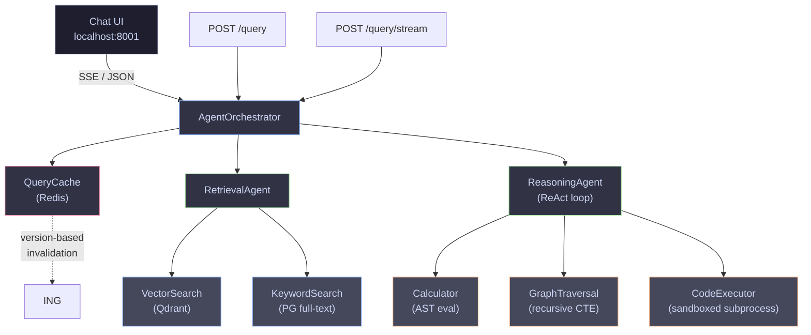
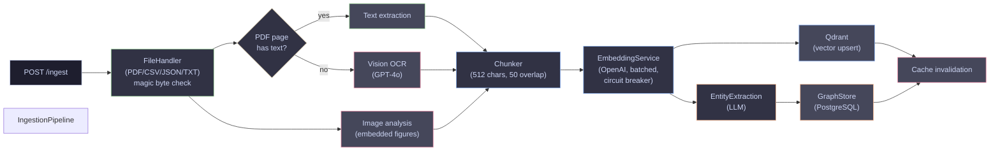

# Scider RAG Pipeline

Multi-agent retrieval and reasoning pipeline over scientific data, built for **Problem B** of the Scider backend engineering challenge.

Ingests scientific papers (PDF with vision OCR, CSV, JSON, TXT), builds a knowledge graph, and answers research questions using a ReAct-style agent loop with tool use, hallucination detection, and real-time SSE streaming with a live reasoning trace.

---

## Quick Start

```bash
git clone <repo>
cd scider-rag
cp .env.example .env          # Set OPENAI_API_KEY=sk-...
docker compose up --build -d
```

Once healthy (~15 s), install the script dependencies and seed data:

```bash
pip3 install requests httpx        # Only needed once, for running host-side scripts
python3 -m scripts.seed_data       # Ingest 7 scientific papers
python3 -m scripts.test_pipeline   # 8 end-to-end tests (query, cache, concurrency, graph, grounding, eval, sandbox, streaming)
```

| URL | What |
|---|---|
| `http://localhost:8001` | **Chat UI**, ask questions with live reasoning trace |
| `http://localhost:8001/docs` | OpenAPI / Swagger UI |
| `http://localhost:8001/redoc` | ReDoc API documentation |

### Try the streaming chat

Open `http://localhost:8001` in your browser. Click any sample question and watch the pipeline reason in real time: cache check, retrieval, tool calls, and reasoning iterations stream live, then sources and answer render progressively. Toggle **"Hallucination check"** for claim-level grounding.

Or from the terminal:

```bash
curl -N -X POST http://localhost:8001/api/v1/query/stream \
  -H "Content-Type: application/json" \
  -d '{"question": "How does self-attention work in Transformers?"}'
```

### Try OCR ingestion

The pipeline can ingest scanned (image-only) PDFs and PDFs with embedded figures. To test, generate a test PDF inside the container and ingest it:

```bash
# Generate a test image-only PDF (no selectable text, triggers vision OCR)
docker compose exec app python3 -c "
import fitz
doc = fitz.open()
page = doc.new_page()
pix = fitz.Pixmap(fitz.csRGB, fitz.IRect(0, 0, 500, 200), 1)
pix.clear_with(200)
page.insert_image(fitz.Rect(50, 50, 550, 250), pixmap=pix)
doc.save('/tmp/test_scanned.pdf')
print('Created /tmp/test_scanned.pdf')
"

# Copy the file out and ingest it
docker compose cp app:/tmp/test_scanned.pdf /tmp/test_scanned.pdf
curl -s -X POST http://localhost:8001/api/v1/ingest \
  -F "file=@/tmp/test_scanned.pdf" | python3 -m json.tool
```

A successful response with `chunks_created > 0` confirms OCR is working. This file has no selectable text and would have failed with `"no extractable text"` without vision OCR. You can also ingest any real scanned PDF or a paper with figures. The pipeline will OCR image-only pages and generate descriptions for embedded charts and diagrams.

To disable OCR (faster ingestion, no vision API cost), set `ENABLE_OCR=false` in `.env`.

---

## Requirements

- **Docker + Docker Compose v2**
- **An OpenAI API key** (models used: `text-embedding-3-small`, `gpt-4o-mini`)
- **Python 3.10+** on the host machine (only needed for running the seed and test scripts)

The application itself and all its services (PostgreSQL, Redis, Qdrant) run entirely in containers. Python is only required on the host to run the seed/test scripts that interact with the API via HTTP.

### Platform setup

| Platform | Setup |
|---|---|
| **macOS** | Install Docker Desktop for Mac from https://docs.docker.com/desktop/install/mac-install/. Both Intel and Apple Silicon are supported. `docker compose` is included. |
| **Linux** (Ubuntu/Debian/Fedora) | Install Docker Engine (https://docs.docker.com/engine/install/) and the Compose plugin (https://docs.docker.com/compose/install/linux/). Or install Docker Desktop for Linux. |
| **Windows** | Install Docker Desktop for Windows from https://docs.docker.com/desktop/install/windows-install/ with the **WSL 2 backend** enabled. This is the recommended approach. All commands in this README should be run from a **WSL terminal** (Ubuntu), not CMD or PowerShell. |

**macOS users**:
1. Install Docker Desktop for Mac (download from the link above, drag to Applications)
2. Open Docker Desktop and wait for the engine to start (whale icon in the menu bar)
3. macOS ships with `python3` and `curl` preinstalled, so no additional tools are needed
4. If `python3` is missing (older macOS), install it via `brew install python3` or from https://www.python.org/downloads/macos/

**Windows users (step by step)**:
1. Open PowerShell as Administrator and run `wsl --install` to install WSL 2 with Ubuntu
2. Restart your machine, then open the **Ubuntu** app from the Start menu
3. Install Docker Desktop for Windows and enable the **WSL 2 integration** in Settings → Resources → WSL Integration
4. Clone the repo inside your WSL home directory (e.g. `~/projects/scider-rag`), not on `/mnt/c/`
5. Run all commands from the WSL Ubuntu terminal

> **Why WSL?** Docker Desktop on Windows uses WSL 2 under the hood. Running commands directly in WSL avoids path translation issues, gives better filesystem performance, and ensures all Unix commands (`curl`, `python3`, etc.) work without modification.

---

## Environment Variables

Copy `.env.example` to `.env` and set at minimum your OpenAI API key. All other values have sensible defaults for local development:

| Variable | Default | Description |
|---|---|---|
| `OPENAI_API_KEY` | *(required)* | OpenAI API key |
| `LLM_MODEL` | `gpt-4o-mini` | Chat completion model |
| `EMBEDDING_MODEL` | `text-embedding-3-small` | Embedding model |
| `EMBEDDING_DIMENSIONS` | `1536` | Embedding vector dimensions |
| `LLM_TEMPERATURE` | `0.1` | LLM sampling temperature |
| `LLM_MAX_TOKENS` | `2048` | Max tokens per LLM response |
| `LLM_TIMEOUT_SECONDS` | `30` | Per-call LLM timeout |
| `DATABASE_URL` | `postgresql+asyncpg://...` | PostgreSQL connection |
| `REDIS_URL` | `redis://redis:6379/0` | Redis connection |
| `QDRANT_HOST` / `QDRANT_PORT` | `qdrant` / `6333` | Qdrant connection |
| `CHUNK_SIZE` | `512` | Chunk size (chars) |
| `CHUNK_OVERLAP` | `50` | Chunk overlap (chars) |
| `RATE_LIMIT_PER_MINUTE` | `60` | Max requests per IP per minute |
| `AGENT_MAX_ITERATIONS` | `5` | ReAct loop iteration cap |
| `RETRIEVAL_TOP_K` | `10` | Max chunks retrieved per query |
| `SANDBOX_TIMEOUT_SECONDS` | `10` | Code execution timeout |
| `SANDBOX_MAX_MEMORY_MB` | `256` | Code execution memory limit |
| `MAX_FILE_SIZE_MB` | `50` | Upload size limit |
| `ENABLE_OCR` | `true` | Vision-based OCR for scanned PDFs |
| `ENABLE_IMAGE_ANALYSIS` | `true` | Analyze embedded figures/charts via vision |
| `OCR_MODEL` | `gpt-4o-mini` | Vision model for OCR and image analysis |
| `MAX_OCR_PAGES` | `50` | Max pages to OCR per document (cost guard) |

Database URLs, Redis URL, and Qdrant host are pre-configured in `.env.example` to match the Docker Compose service names, no changes needed for local development.

---

## Feature Matrix

| Requirement | Level | Implementation |
|---|---|---|
| Ingest ≥ 2 source types | **L1 Core** | PDF (with vision OCR + image analysis), CSV, JSON, TXT via handler chain with magic byte validation |
| Retrieval agent with search strategy | **L1 Core** | LLM-planned vector / keyword / hybrid search |
| Reasoning agent with ≥ 1 non-retrieval tool | **L1 Core** | ReAct loop with Calculator, GraphTraversal, CodeExecutor |
| Query API: answer + sources + latency | **L1 Core** | `POST /query` with latency breakdown |
| Concurrent query isolation | **L2 Scale** | Per-request `AgentContext`, global `asyncio.Semaphore` |
| Intelligent cache with staleness control | **L2 Scale** | Redis + version-based invalidation on ingestion |
| Entity graph traversal | **L2 Scale** | Recursive CTE in PostgreSQL, no separate graph DB |
| Hallucination detection | **L3 Robust** | LLM-as-judge grounding check, opt-in via `check_grounding` |
| Systematic evaluation framework | **L3 Robust** | `POST /eval` with LLM-as-judge correctness + p95 latency |
| Sandboxed code execution | **L3 Robust** | Subprocess isolation, `resource.setrlimit`, import allowlist |

### Beyond the brief

| Feature | Why |
|---|---|
| **SSE streaming with reasoning trace** | Real-time visibility into every pipeline step (cache → retrieval → tool calls → reasoning → answer). Designed for IDE panel integration, the exact use case Scider serves. |
| **Chat UI** | Single-file HTML/CSS/JS served at `/`, consumes the streaming endpoint. Dark IDE theme, source cards with relevance bars, collapsible thinking trace, grounding toggle. Zero build tools, zero extra dependencies. |
| **Vision OCR + image analysis** | Scanned/image-only PDFs are OCR'd via GPT-4o vision. Embedded figures and charts are analyzed and their descriptions are injected into the text before chunking, so the pipeline can answer questions about visual content in papers. |
| **Content-hash deduplication** | SHA-256 hash of file content prevents re-ingestion of identical documents. Saves embedding API cost and avoids duplicate chunks in the vector store. |
| **Security hardening** | Rate limiting, request ID tracking, magic byte file validation, input sanitization (XSS/SQL injection/path traversal), security headers, circuit breaker on external APIs, pipeline timeout. |

---

## Architecture

### Query pipeline



### Ingestion pipeline



Each query gets a fresh `AgentContext`. No mutable state is shared between requests. The semaphore caps concurrent LLM calls at 10, and a total pipeline timeout (`3 × LLM_TIMEOUT_SECONDS`) prevents runaway requests.

---

## API Endpoints

| Method | Path | Description |
|---|---|---|
| `GET` | `/` | Chat UI (live streaming reasoning trace) |
| `GET` | `/api/v1/health` | Service health check (Postgres, Redis, Qdrant) |
| `POST` | `/api/v1/ingest` | Upload a file (PDF, CSV, JSON, TXT) |
| `GET` | `/api/v1/documents` | List ingested documents |
| `POST` | `/api/v1/query` | Ask a research question |
| `POST` | `/api/v1/query/stream` | Streaming variant (Server-Sent Events) |
| `POST` | `/api/v1/eval` | Batch evaluation with LLM-as-judge scoring |

### Query request

```json
{
  "question": "How does scaled dot-product attention work in the Transformer?",
  "filters": null,
  "max_sources": 5,
  "check_grounding": false
}
```

`filters` accepts an optional dictionary for source-type filtering (e.g. `{"source_type": "pdf"}`). All fields except `question` are optional.

### Query response

```json
{
  "answer": "...",
  "sources": [{"document_title": "...", "chunk_content": "...", "relevance_score": 0.87}],
  "latency": {"retrieval_ms": 1240, "reasoning_ms": 4100, "total_ms": 5360},
  "confidence": 0.72,
  "request_id": "a1b2c3d4",
  "grounding": null
}
```

Setting `check_grounding: true` runs hallucination detection and returns a `grounding` object with per-claim support status. Adds ~1–2 s (one extra LLM call).

### Streaming events (SSE)

`POST /query/stream` returns a `text/event-stream` with this event sequence:

| Event | Payload | When |
|---|---|---|
| `status` | `{step, message}` | Each pipeline step (cache, retrieval, tool calls, reasoning iterations) |
| `sources` | `[{document_title, relevance_score, …}]` | After retrieval, rendered early for progressive UI |
| `answer` | `{text}` | After reasoning completes |
| `done` | Full result (same shape as `/query`) | Pipeline finished |
| `error` | `{message, request_id}` | On failure |

---

## Key Architectural Decisions

### No LangChain / LlamaIndex

The brief asked to avoid black-box wrappers. Every abstraction is written from scratch so behaviour is fully transparent: the ReAct loop is ~40 lines in `src/agents/reasoning.py`, retrieval strategy planning is a structured JSON prompt in `src/agents/retrieval.py`, and OpenAI function-calling drives tool dispatch directly. This also avoids the dependency bloat and version churn typical of framework-heavy RAG stacks.

### PostgreSQL for the entity graph (no Neo4j)

Neo4j would add a fifth operational dependency. The relationship queries needed here, multi-hop traversal with cycle prevention, are expressible as a single recursive CTE in PostgreSQL. This keeps the stack to four services and the graph stays transactionally consistent with document and chunk data.

```sql
WITH RECURSIVE graph_walk AS (
    -- base case: direct neighbours
    -- recursive step: follow edges, guard cycles with path array
)
SELECT DISTINCT entity_id, depth, ...
```

### Version-based cache invalidation

Rather than scanning and deleting keys when new data arrives, the cache key includes a version number fetched from Redis. On every ingestion, the version is incremented (`INCR cache:version`). Old cache entries become unreachable immediately (they use the previous version in their key) and expire naturally via TTL. This is O(1) on write and eliminates key-scan latency spikes.

### Cache stampede prevention

When a cache miss occurs for a popular query, concurrent requests would all trigger the expensive LLM pipeline simultaneously. A Redis distributed lock (`SETNX`) ensures only one request computes the result; others see the lock, re-check the cache, and return the freshly-written value. This prevents cascading load under traffic bursts.

### Streaming as an additive layer

The SSE streaming endpoint (`POST /query/stream`) is implemented alongside the existing `POST /query`, not as a replacement. `run_stream()` and `execute_stream()` are parallel async generators added to `AgentOrchestrator` and `ReasoningAgent` respectively. The original `run()` and `execute()` are completely untouched. An internal `_result` event type lets generators pass structured data back to the orchestrator without forwarding it to clients. This makes the streaming feature fully backward-compatible and independently testable.

### Hallucination detection is opt-in

Running a grounding check on every query doubles LLM cost per request. It is gated behind `check_grounding: true` so production workloads pay only when they need claim-level attribution. Grounding is never cached. Even on cache hits, a fresh grounding check runs when requested, because the detection model may have changed or the user may want fresh verification.

### Confidence score is retrieval-based, not self-reported

The `confidence` field is the mean cosine similarity of the top-5 retrieved chunks, a factual measurement from the retrieval step. It is intentionally not the LLM's self-reported confidence (which is unreliable). When `check_grounding: true`, callers also get `grounding.confidence`, which is the fraction of claims judged "supported" by a separate LLM pass.

### Sandboxed code execution

The reasoning agent can run Python to answer quantitative questions. The sandbox uses subprocess isolation with `resource.setrlimit` to cap CPU time (10 s) and memory (256 MB), a static analysis pass blocking dangerous patterns (`exec`, `eval`, `__import__`, `open`, `subprocess`, `os.system`), an import allowlist (`math`, `statistics`, `json`, `re`, `itertools`, `collections`, `datetime`, `decimal`, `fractions`, `functools`, `string`, `textwrap`), and a clean minimal environment (no inherited secrets). The process is force-killed after the timeout regardless of state.

### Circuit breaker on OpenAI API

The embedding service uses a circuit breaker (CLOSED → OPEN → HALF_OPEN state machine) layered on top of tenacity retries. After 5 consecutive failures, the circuit opens and calls are rejected immediately for 30 seconds, preventing cascading failures and wasted API credits during outages. A probe request after the timeout transitions to HALF_OPEN; if it succeeds, the circuit closes.

---

## Security Hardening

| Layer | Mechanism |
|---|---|
| Input sanitization | HTML/XSS stripping (bleach), SQL injection pattern detection, filename sanitization, path traversal prevention |
| File upload validation | Extension allowlist + magic byte signature verification (rejects spoofed files) |
| Rate limiting | Redis-backed sliding window per IP (`RateLimitMiddleware`, 60 req/min) |
| Request isolation | UUID `X-Request-ID` header, per-request `AgentContext`, no shared mutable state |
| Code sandbox | Subprocess isolation, import allowlist, `resource.setrlimit` (CPU + memory), clean env |
| Security headers | `X-Content-Type-Options`, `X-Frame-Options`, `X-XSS-Protection`, body size limit |
| API resilience | Circuit breaker on OpenAI calls, total pipeline timeout (`asyncio.wait_for`) |
| Body size limits | Configurable max upload size (50 MB default), enforced at middleware layer |

---

## Project Structure

```
src/
  main.py               App factory, middleware stack, route registration, chat UI mount
  config.py              Pydantic Settings, all config from env vars
  dependencies.py        Shared connection pools and FastAPI dependency injection

  api/
    v1/
      query.py           POST /query, full pipeline, JSON response
      stream.py          POST /query/stream, SSE with reasoning trace
      ingest.py          POST /ingest, GET /documents
      eval.py            POST /eval, batch evaluation
      health.py          GET /health, dependency checks
    middleware/
      request_id.py      X-Request-ID tracking (contextvars)
      rate_limit.py      Redis sliding window rate limiter
      security.py        Security headers + body size enforcement
    schemas/             Pydantic request/response models

  agents/
    orchestrator.py      AgentOrchestrator, run() and run_stream() pipelines
    retrieval.py         RetrievalAgent, LLM-planned search strategy
    reasoning.py         ReasoningAgent, ReAct loop, execute() and execute_stream()
    base.py              AgentContext, AgentResult, BaseAgent protocol
    tools/
      calculator.py      Safe AST-based math evaluation
      code_executor.py   Sandboxed subprocess Python execution
      graph_traversal.py Multi-hop entity traversal via recursive CTE
      search.py          VectorSearchTool, KeywordSearchTool

  ingestion/
    pipeline.py          Full ingestion flow: parse → chunk → embed → store → extract entities
    chunker.py           Recursive text splitting with configurable size and overlap
    embeddings.py        OpenAI embeddings with batching, retries, circuit breaker
    ocr.py               Vision-based OCR and image analysis (GPT-4o)
    handlers/            PDF (PyMuPDF + vision OCR), CSV, JSON, TXT file parsers

  storage/
    models.py            SQLAlchemy ORM, documents, chunks, entities, relationships
    document_store.py    PostgreSQL CRUD + full-text search
    vector_store.py      Qdrant operations (upsert, search, delete)
    graph_store.py       Entity/relationship storage, recursive CTE traversal
    cache.py             Redis query cache with version-based invalidation + stampede locks
    init_db.py           Schema creation, Qdrant collection setup

  evaluation/
    evaluator.py         Batch pipeline evaluation (PipelineEvaluator)
    hallucination.py     LLM-based claim-level grounding check
    metrics.py           LLM-as-judge correctness scoring

  security/
    sanitizer.py         XSS, SQL injection, path traversal prevention
    circuit_breaker.py   Async circuit breaker (CLOSED → OPEN → HALF_OPEN)
    sandbox.py           Code execution security policy re-exports

  static/
    index.html           Chat UI, single-file dark-themed IDE-style interface

tests/
  unit/                  85 tests: chunker, cache, calculator, sanitizer, circuit breaker,
                         magic bytes, SSE formatting, event contracts, OCR + image analysis
  integration/           API tests with mocked services

scripts/
  test_pipeline.py       8 end-to-end tests (query, cache, concurrency, graph, grounding,
                         eval, sandbox, streaming) across AI/ML, quantum, and biology domains
  seed_data.py           Ingest sample papers + smoke test
  ingest_data.py         Bulk ingestion
  run_eval.py            CLI evaluation runner
```

---

## Running Tests

```bash
# Unit tests (85 tests, no external services needed, run inside Docker)
docker compose exec app python -m pytest tests/unit/ -v

# Full pipeline demo (requires running stack + ingested data)
python3 -m scripts.test_pipeline

# Evaluation against live stack
python3 -m scripts.run_eval
```

### Test coverage by domain

The end-to-end test suite (`scripts/test_pipeline.py`) exercises all three scientific domains present in the ingested corpus:

- **AI/ML**: Transformer self-attention, BERT masked language modelling, GPT-3 few-shot learning
- **Quantum computing**: Grover's algorithm, quantum speedup complexity, superposition
- **Biology**: CRISPR-Cas adaptive immunity, GDSC drug sensitivity biomarkers, cancer genomics

This ensures the pipeline generalises across domains rather than being tested against a single paper.

---

## Infrastructure

| Service | Image | Purpose | Port |
|---|---|---|---|
| app | Python 3.12-slim | FastAPI + uvicorn | 8001 |
| postgres | postgres:16-alpine | Documents, chunks, entity graph | 5433 |
| redis | redis:7-alpine | Query cache, distributed locks, rate limits | 6380 |
| qdrant | qdrant/qdrant:v1.12.4 | Vector embeddings (1536-dim, cosine) | 6334 |

All services run as non-root users. The app container uses a dedicated `appuser`. Health checks ensure `app` only starts after all dependencies are ready.

---

## Known Limitations

**Latency**: End-to-end query latency is 5–15 s on cache miss because the ReAct loop makes 2–4 sequential OpenAI API calls. The streaming endpoint mitigates perceived latency (the user sees progress live), and cache hits return in <50 ms.

**Embedding dimension lock-in**: If `EMBEDDING_DIMENSIONS` is changed after the Qdrant collection is created, ingestion will fail. A migration path (recreate collection, re-embed all chunks) should be automated.

**Entity extraction quality**: Entities are extracted with a single LLM call using a JSON prompt. On complex scientific documents, this produces noisy or redundant entities. A dedicated NER model (e.g. SciSpacy) would improve graph quality.

**Rate limiting is per-IP**: A production system should rate-limit per authenticated user/API key to prevent trivial bypass via proxies.

**Evaluation dataset**: The fixture questions cover three domains but only 3–8 questions each. A real evaluation set should have 50–200 questions with ground-truth answers derived from the corpus.

**Image analysis limited to raster images**: The image analysis feature uses PyMuPDF's `page.get_images()` to find embedded figures, which only detects raster images (PNG/JPEG). Most scientific papers (especially from arXiv) embed figures as vector graphics (PDF drawing operations), which are invisible to this API. The feature works correctly on PDFs with actual embedded raster images, verified with test PDFs showing `images_analyzed: 1`, but will report `images_analyzed: 0` on vector-heavy papers. A more robust approach would render each page as a raster image and use vision to detect figure regions, at the cost of higher API usage.

---

## What I Would Do Differently With More Time

**Token-level streaming**: The current SSE streaming shows pipeline steps in real time, but the answer text arrives as a complete block. Integrating OpenAI's streaming API (`stream=True`) would let the answer render token-by-token, matching the ChatGPT/Claude experience and further reducing perceived latency.

**Hybrid reranking**: The retrieval agent uses cosine similarity from the embedding model. Adding a cross-encoder reranker (e.g. `bge-reranker-v2-m3`) as a second pass would significantly improve retrieval precision, especially for domain-specific scientific queries.

**Structured logging**: The application uses Python's standard `logging` module. For production observability, JSON-structured logs (via a custom formatter or `python-json-logger`) would make log aggregation, alerting, and trace correlation across services far more effective.

**Authentication and RBAC**: The system is currently open. Adding JWT-based auth with scoped API keys would enable per-user rate limiting, audit trails, and multi-tenant isolation.

**Incremental ingestion**: Currently, re-ingesting a modified file creates a new document record. A proper incremental pipeline would diff against existing chunks, update only what changed, and selectively re-embed, saving significant API cost on large corpora.

**Observability**: Adding OpenTelemetry traces (spans for each pipeline step) and Prometheus metrics (query latency histograms, cache hit rates, LLM call counts) would give production-grade visibility into system behaviour under load.

---

## Interesting Problems Solved During Development

### Null bytes in scientific PDFs crashed PostgreSQL inserts

When ingesting older scientific papers (particularly LaTeX-generated PDFs from arXiv), the pipeline would fail silently during chunk storage. The error: PostgreSQL rejects `\x00` (null bytes) in text columns, and PyMuPDF's text extraction preserves them from the underlying PDF stream. These null bytes are invisible. The extracted text looks perfectly normal in logs and print statements.

The fix was surgical: strip null bytes at two layers, once in the PDF handler immediately after extraction (`text.replace("\x00", "")`) and again in the ingestion pipeline before chunking, as a defence-in-depth measure. This is a real-world data quality issue that only surfaces when you work with actual scientific PDFs rather than clean test fixtures.

### Grounding check was silently skipped on cache hits

The hallucination detection feature worked perfectly on the first query but returned `null` when the same question was asked again with `check_grounding: true`. The bug: the original `run()` method cached the full result (including `grounding: null`) and returned it verbatim on cache hits, skipping the grounding check entirely.

The insight was that grounding should *never* be cached. A cached answer may have been produced without grounding, and the user requesting `check_grounding: true` explicitly wants fresh verification. The fix restructures `run()` so grounding always runs *after* the cache lookup, on the final result regardless of its source. This is a subtle correctness bug that would have been invisible without the end-to-end test that verifies grounding on cache hits.

### Cache stampede under concurrent load

During the concurrency test (8 parallel identical queries), the pipeline would sometimes execute the full LLM pipeline 8 times simultaneously for the same question, wasting API credits and adding unnecessary load. The standard "check cache, miss, compute, store" pattern has a race window: between the cache miss and the store, all concurrent requests see the miss and all compute.

The solution uses a Redis distributed lock (`SET key NX EX 30`): the first request acquires the lock and computes; others see the lock exists, wait briefly, then re-check the cache for the freshly-written result. This is the classic cache stampede / thundering herd pattern, but implementing it correctly with an async generator (for the streaming variant) required careful placement of `try/finally` to ensure lock release even if the generator is abandoned mid-stream.

### Streaming needed an internal event type that clients never see

The SSE streaming pipeline has three layers of async generators: `ReasoningAgent.execute_stream()` yields reasoning events, `AgentOrchestrator._run_pipeline_stream()` wraps it with retrieval events, and `AgentOrchestrator.run_stream()` adds cache and grounding. Each layer needs to pass a final structured result to its parent *without* forwarding it to the client.

The solution was an internal `_result` event type: the innermost generator yields `("_result", AgentResult(...))` as its final event. The parent generator intercepts it, extracts the data, and never forwards it to the SSE stream. This avoids coupling the generators with return values (which don't work naturally with `async for`) and keeps each layer composable. The client only ever sees `status`, `sources`, `answer`, `done`, and `error`. The `_result` events are consumed internally and never serialized.

---

## AI Usage Transparency

This project was built primarily by hand. Claude was used as a development assistant for roughly **20–25%** of the overall effort, scoped to specific categories below. All architectural decisions, core pipeline logic, agent design, and system integration were written and reasoned through manually.

### Where AI was used

| Category | What Claude helped with | What I did manually |
|---|---|---|
| **Debugging** | Diagnosing environment issues (Docker credential errors, broken venv paths, WSL quirks), tracing data flow bugs (e.g. grounding check silently skipped on cache hits, null bytes in PDF extraction) | Identifying the root cause, deciding the fix strategy, and writing the actual fix |
| **Boilerplate scaffolding** | Generating repetitive structural code — Pydantic schema definitions, SQLAlchemy model boilerplate, FastAPI route skeletons, test fixture setup | All business logic, agent orchestration, ReAct loop, caching strategy, security hardening, and pipeline design |
| **README authoring** | Sanitizing and structuring the README — Claude helped clean up rough notes into well-formatted markdown with consistent tables, mermaid diagrams, and section organization | All technical content, architectural rationale, and "Interesting Problems" narratives are my own observations from building the system |

### Where AI was NOT used

- **Architecture and design**: The multi-agent pipeline design (retrieval → reasoning with ReAct loop), the decision to use PostgreSQL recursive CTEs instead of Neo4j, version-based cache invalidation, cache stampede prevention, streaming as an additive layer — all designed and implemented manually.
- **Core agent logic**: `ReasoningAgent`, `RetrievalAgent`, `AgentOrchestrator`, tool dispatch, context isolation — written from scratch without AI generation.
- **Security**: Sandbox isolation (`resource.setrlimit`, import allowlist, static analysis), input sanitization, circuit breaker, rate limiting — implemented manually with security-first reasoning.
- **Evaluation framework**: Hallucination detection, LLM-as-judge scoring, batch evaluation endpoint — designed and built without AI assistance.

### README automation via MCP

Claude was allowed to commit **only the `README.md` file** to the `dev` branch via an MCP (Model Context Protocol) server integration. This was done to automate frequent README updates during iterative development — the README went through many revisions as features were added, and manually committing each formatting change was slowing down the workflow.

This is explicitly **not** a recommended practice for production workflows. Allowing an AI tool to make git commits introduces risks:
- Commits bypass human review of the exact diff being pushed
- Commit messages may not reflect the developer's intent accurately
- It can obscure the audit trail of who authored what

I limited the scope to a single non-code file (`README.md`) on a feature branch (`dev`) only, and reviewed the diffs before merging to `main`. For all code changes, commits were made manually after review.

### Security practices when using AI assistants

- **No secrets in prompts**: API keys, credentials, and `.env` contents were never shared with Claude. Environment variable names and structure were discussed, but never actual values.
- **Code review before commit**: All AI-suggested code was reviewed, tested, and often rewritten before being integrated. The debugging suggestions were treated as hypotheses to verify, not as authoritative fixes.
- **No blind copy-paste**: Boilerplate generated by Claude was adapted to fit the project's existing patterns (e.g. matching the project's async-first style, error handling conventions, and naming schemes).
- **Scoped access**: Claude had read access to the codebase for context but code changes were applied manually (except the README MCP automation noted above).
